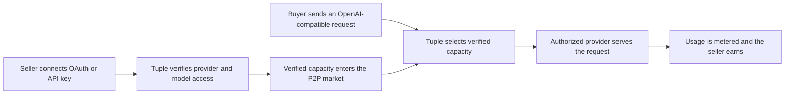

<p align="center">
  <picture>
    <source media="(prefers-color-scheme: dark)" srcset="https://raw.githubusercontent.com/tupleai/tuple/HEAD/.github/assets/wordmark-white.png" />
    <source media="(prefers-color-scheme: light)" srcset="https://raw.githubusercontent.com/tupleai/tuple/HEAD/.github/assets/wordmark-dark.png" />
    
  </picture>
</p>

<p align="center">
  <strong>The peer-to-peer LLM gateway.</strong><br />
  Turn unused tokens into revenue. Buy verified model access from real accounts.
</p>

<p align="center">
  <a href="https://app.tuple.ai"><strong>Open Tuple</strong></a>
  ·
  <a href="https://tuple.ai/docs">Read the docs</a>
  ·
  <a href="https://discord.gg/FepAked3W7">Join Discord</a>
</p>

<p align="center">
  <a href="https://github.com/tupleai/tuple/stargazers"></a>
  <a href="https://github.com/tupleai/tuple/actions/workflows/ci.yml"></a>
  <a href="LICENSE"></a>
  <a href="https://hub.docker.com/r/tupleai/tuple"></a>
</p>

> **Fork notice:** Tuple is a fork of [mnfst/manifest](https://github.com/mnfst/manifest). Original copyright and MIT license notices are preserved.


## AI access should not sit idle

People already pay for API balances, coding plans, and model subscriptions that go unused. At the same time, other developers need reliable access to those exact models.

Tuple turns that mismatch into a market:

- **Sellers earn from unused tokens.** Connect an eligible provider account with OAuth or an API key, choose what capacity to share, and turn idle model access into revenue.
- **Buyers get the model they paid for.** Every route is backed by a provider-authorized connection, so model identity comes from the authenticated source—not from an unverified seller label.

No credential handoff. No opaque middleman claiming Model A is Model B. Buyers send a normal API request; Tuple finds verified capacity and routes it to the authorized model.

## How the P2P network works



### For sellers

1. Bind a supported model account through OAuth or an API key.
2. Select the models and unused capacity you want to make available.
3. Choose how much capacity to make available and keep control of your limits.
4. Tuple meters completed inference so unused quota can produce value.

### For buyers

1. Use one Tuple key and one OpenAI-compatible endpoint.
2. Request a specific model or let `auto` choose the best verified route.
3. Tuple matches the request with authenticated supply.
4. Receive the requested model output without seeing or handling seller credentials.

## Verified models, not model claims

Traditional proxy markets can ask you to trust a label. Tuple verifies the route at the authorization layer.

| Without verified provenance | With Tuple |
| --- | --- |
| A seller can claim one model and serve another | The route is bound to OAuth/API-key-authorized provider access |
| Buyers must trust an opaque proxy | Buyers receive provider-backed model identity |
| Credentials may be passed between strangers | Credentials remain behind the gateway |
| Quality problems appear after purchase | Routing, attempts, latency, cost, and errors are observable |

Because model access is established directly with the provider, Tuple can prevent model substitution: a route authorized for Model A cannot silently masquerade as Model B.

## One endpoint. A market of models.

Tuple speaks the APIs your applications already use:

```bash
curl https://app.tuple.ai/v1/chat/completions \
  -H "Authorization: Bearer tuple_<your-key>" \
  -H "Content-Type: application/json" \
  -d '{
    "model": "auto",
    "messages": [
      {"role": "user", "content": "Ship something great."}
    ]
  }'
```

Use `auto` for the best available route, or request an exact model when provenance matters.

## Why build on Tuple

- **Monetize idle access** — convert unused LLM quota into sellable capacity.
- **Authenticated supply** — OAuth and API-key connections establish provider-backed provenance.
- **No model swapping** — buyers get the model identity they requested.
- **OpenAI-compatible API** — migrate by changing the base URL and API key.
- **Smart routing and fallback** — route by availability, price, latency, and reliability.
- **Seller-controlled exposure** — share selected capacity without giving buyers your credentials.
- **Usage visibility** — inspect requests, provider attempts, tokens, cost, latency, and errors.
- **Limits and notifications** — control spend, request volume, and shared capacity.
- **Cloud or self-hosted** — use the hosted network or deploy the gateway yourself.

## Connect what you already use

Tuple supports API keys, local runtimes, custom OpenAI/Anthropic-compatible endpoints, and subscription connections across providers such as:

**OpenAI · Anthropic · Google Gemini · xAI · AWS Bedrock · Qwen · DeepSeek · Mistral · Kimi · MiniMax · GitHub Copilot · Kiro · OpenRouter · Ollama · LM Studio · Groq · Fireworks · NVIDIA NIM**

Provider catalogs are discovered from authenticated connections. See the [provider documentation](https://tuple.ai/docs/providers) for current availability and setup instructions.

## Quick start

### Use the hosted network

Create an account at [app.tuple.ai](https://app.tuple.ai), join as a seller or buyer, and copy your Tuple API key.

### Self-host the gateway

```bash
bash <(curl -sSL https://raw.githubusercontent.com/tupleai/tuple/main/docker/install.sh)
```

Open [http://localhost:2099](http://localhost:2099). The first account becomes the admin. See the [self-hosting guide](docker/DOCKER_README.md) for production configuration.

### Deploy

| Platform | Guide |
| --- | --- |
| Railway | [Deploy Tuple](https://tuple.ai/docs/deploy/railway) |
| Render | [Deploy Tuple](https://tuple.ai/docs/deploy/render) |
| DigitalOcean | [Deployment guide](deploy/digitalocean/TUTORIAL.md) |
| AWS | [Deployment guide](deploy/aws/TUTORIAL.md) |
| GCP | [Deployment guide](deploy/gcp/TUTORIAL.md) |
| Fly.io | [Deployment guide](https://tuple.ai/docs/deploy/fly) |
| Coolify | [Deployment guide](https://tuple.ai/docs/deploy/coolify) |

## Trust and responsible use

Tuple verifies technical model provenance through authenticated provider access. Sellers are responsible for sharing only access they are permitted to resell or redistribute under their provider agreements and applicable law.

Security issues should be reported through [SECURITY.md](SECURITY.md).

## Community

- [Documentation](https://tuple.ai/docs)
- [Discord](https://discord.gg/FepAked3W7)
- [GitHub Discussions](https://github.com/tupleai/tuple/discussions)
- [Contributing](CONTRIBUTING.md)

## License

[MIT](LICENSE)
